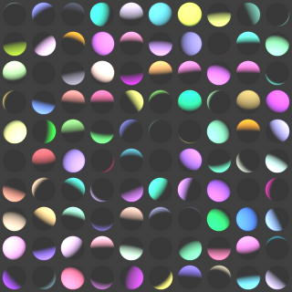
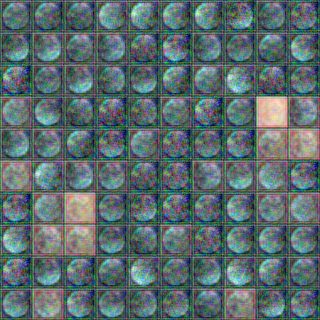
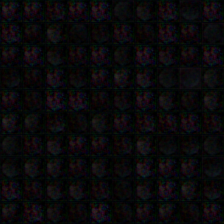
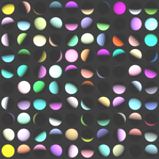
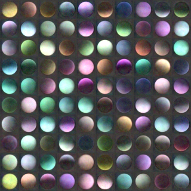
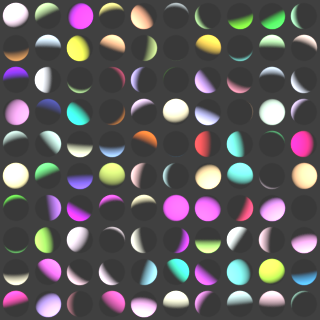
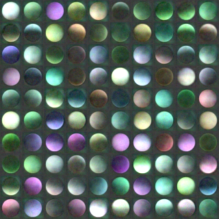
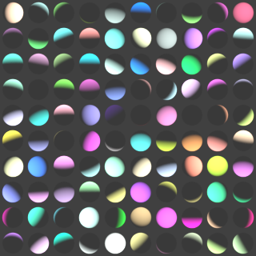
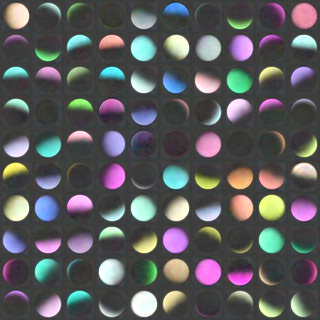
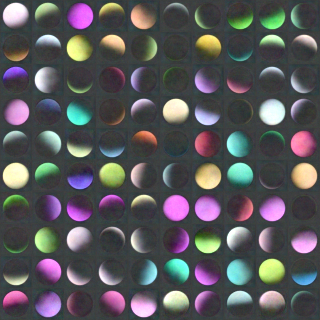

# Intro
The idea of this project is to use a Convolutional Neural Network to render a realistic 3D scene.
Typical renderers like Cycles of Blender simulate light in a physically based way. This allows
them to render any kind of scenes. The space of possible scenes they are capable of rendering is
a lot larger than the space of scenes actually created by artist for movies or games. The
motivation behind using a Deep Learning model is that it may be able to learn how to render
probable scenes in a realistic way with less computation that a physically based renderer.

The CNN learns in a supervised way. It is fed scene information as input and the corresponding
rendered image of that scene as groundtruth. Scenes are generated and rendered in Blender. For
now it is very simple: the scene is a sphere with the default Blender material and a sun lamp
with random direction, color and strength.

After the first epoch, the predictions are still quite random:

|            | Groundtruth | Prediction |
| ---------- |:-------------:| :-----:|
| Train      |  |  |
| Validation |  |  |

After 50 epochs, it learned how to colorize the sphere:

|            | Groundtruth           | Prediction  |
| ---------- |:-------------:| :-----:|
| Train      |  |  |
| Validation |  |  |

After 350 epochs, it started to better learn shadows (they slowly become sharper in the next hundreds of epochs):

|            | Groundtruth           | Prediction  |
| ---------- |:-------------:| :-----:|
| Train      |  |  |
| Validation |  |  |

The CNN architecture is copied from the
[Generating Faces with Torch](http://torch.ch/blog/2015/11/13/gan.html)
blog post by Larsen and Sønderby on the Torch website.

# How to use
## Dependencies
1. [Blender](https://www.blender.org "Blender") for generating the dataset
2. [Torch](http://torch.ch/ "Torch") for CNN training
3. Torch modules (install with `luarocks install <pachage name>`):
    * image
    * cunn (only if using the GPU)

## Dataset generation
Go to [data](data/README.md) for instruction on how to generate the dataset.

## Training
Execute `qlua main.lua` to launch training (qlua is needed for displaying images along the way).
Some parameters can be changed in each file. It uses the GPU by default but it can be disabled
in the main.lua file in line 7.

(TODO: add some images of rendered scenes from training and validation steps)

# Ideas for later
Describe a scene with in terms of triangles

Use a RNN to input a list of triangles with varying length

Depart from the supervised learning method and make the network learn what a realistic scene
looks like by analysing real photos.